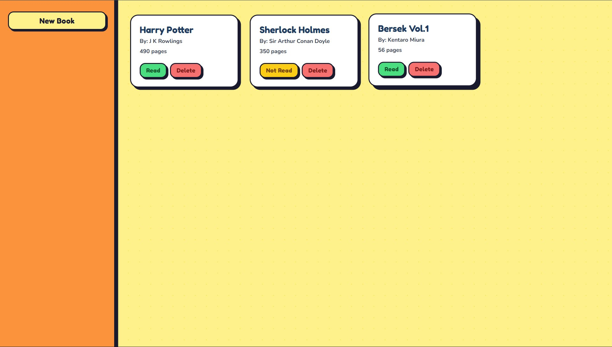

# 📚 My Library

A fun, cartoony browser-based app to track your personal book collection. Add books, mark them as read or unread, and delete them — all without a backend or database.



---

## Features

- **Add books** via a sidebar form (title, author, pages, read status)
- **Toggle read status** — flip between "Read" and "Not Read" with a single click
- **Delete books** instantly from your collection
- **Cartoony UI** with chunky borders, hard shadows, and a polka-dot background

---

## Project Structure

```
my-library/
├── index.html      # App markup and form structure
├── style.css       # Cartoony styles (Fredoka One + Nunito fonts)
├── script.js       # Book logic, DOM rendering, event handling
└── README.md
```

---

## How It Works

Books are stored as objects in a plain JavaScript array (`myLibrary`). Each `Book` is created using a constructor function and given a unique ID via `crypto.randomUUID()`. The `display()` function re-renders all cards from scratch on every change.

```js
function Book(title, author, pages, read) {
    this.title = title;
    this.author = author;
    this.pages = pages;
    this.read = read;
    this.id = crypto.randomUUID();
}

Book.prototype.toggleRead = function () {
    this.read = !this.read;
}
```

> **Note:** Data is not persisted — refreshing the page clears the library. For persistence, `localStorage` or a backend API could be added.

---

## Getting Started

No build tools or dependencies needed. Just open `index.html` in any modern browser:

```bash
# Clone or download the project, then:
open index.html
```

Or serve it locally:

```bash
npx serve .
# Visit http://localhost:3000
```

---

## Tech Stack

| Layer | Technology |
|-------|-----------|
| Markup | HTML5 |
| Styling | CSS3 (Google Fonts: Fredoka One, Nunito) |
| Logic | Vanilla JavaScript (ES6+) |

---

## Possible Improvements

- Persist books to `localStorage` so they survive page refreshes
- Add search/filter by title or author
- Sort cards by title, author, or read status
- Edit existing book entries
- Import/export library as JSON
